# 1）项目设计部分：

## （1）项目总体构成；

运用本学期学到的 nodejs+mongodb+express+ejs+git等等内容，较为简单地实现了用户的注册，登录（注册登录过程都对密码实施了加密），管理员与用户的划分，商品浏览、搜索、增加、删除、修改、分页，搭建出一个较为全面的商品管理系统。

## （2）引入的包在项目中的作用相关说明；

mongodb，为程序提供的一个驱动来操作mongoDB数据库

mongoose，基于mongodb构建的一个对象操作模型，适用于nodejs

ejs，模板语言，通过数据和模板，可以生成HTML标记文本。

express，保持最小规模的灵活的 Node.js Web 应用程序开发框架，为 Web 和移动应用程序提供一组强大的功能。

md5-node，对密码进行加密。

multiparty，解析FormData数据的一款插件。

express-session，一种记录客户状态的机制，会对一次对话产生一个唯一的标识进行标识。

body-parser，让服务器解析html请求体。

fs，使用文件系统

git，连接到github

## （3）项目目录结构和各个部分的说明。

### node_modules文件：安装node后用来存放用包管理工具下载安装的包的文件夹。

### app.bac.js：配置路由、session

### app.js:主函数，具体实现登陆注册、图片上传、商品编辑功能，配置 body-parser 中间件与路由

### database.js：数据库连接

### mongodb.js：数据库增删改查功能实现

### package.json

### package-lock.json

### public文件下：

bootstrap-4.3.1-dist包

css文件

js文件

#### 以上均为页面优化所需要的包和模板

upload文件：上传图片的文件夹

### router文件下：程序中的路由文件

admin.js：管理设置

#### admin文件：

login.js：登陆设置，划分用户与管理员

product.js：管理员商品界面

productuser.js：用户商品界面

##### product文件：管理员翻页、查询功能

next.js

previous.js

search.js

##### productuser文件:用户翻页、查询功能

next.js

previous.js

search.js

### upload文件夹，均为上传图片数据

### views文件夹：页面实现

login.html：登陆页面

main.html：主页面

product.html：管理员商品页面

productadd.html：商品上架页面

productedit.html：商品修改页面

productuser.html：用户商品页面

register.html：注册页面

#### public文件夹：

header.html：页面框架

prolist.html：管理员商品列表页面

prolistuser.html：用户商品列表页面

# 2）使用说明书：

本项目参考https://blog.csdn.net/qq_41672008/article/details/90239071该blog提供的开源程序基础上，进行修改并实现题目要求。

### 每个功能的使用方法。

#### 登陆功能：分为用户与管理员登陆

管理员账户为：admin

密码为：123

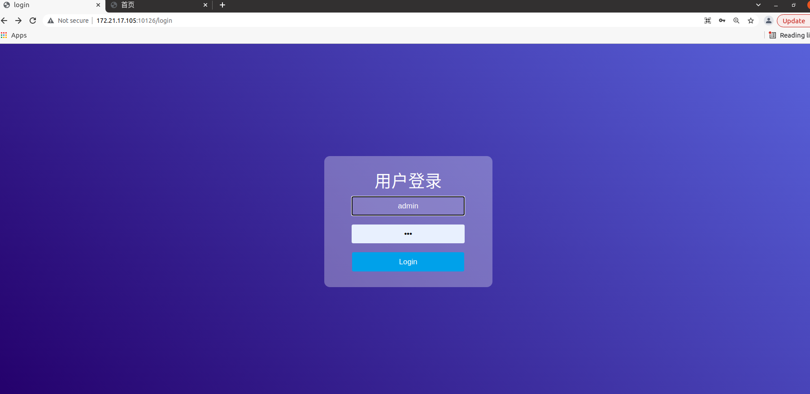

用户账户信息在user表中，如：用户名为w，密码为123

#### 注册功能：为新用户提供注册账户的功能，输入新用户名和密码，即可注册成功

#### 登陆后，对管理员而言：

可以进行商品管理操作，比如对单个商品修改或者删除，或者有新商品时进行上架。

#### 增加功能：

进入页面：

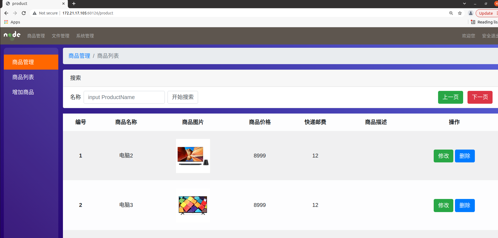

上架商品：

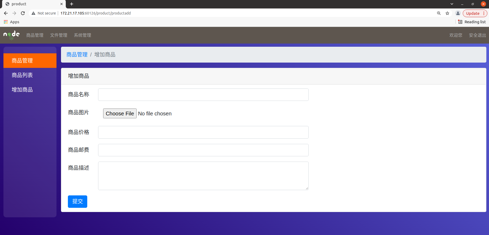

上架成功提示：

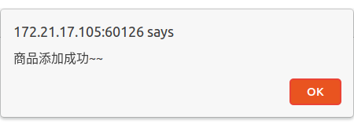

#### 修改商品信息：

点击修改

即跳到修改页面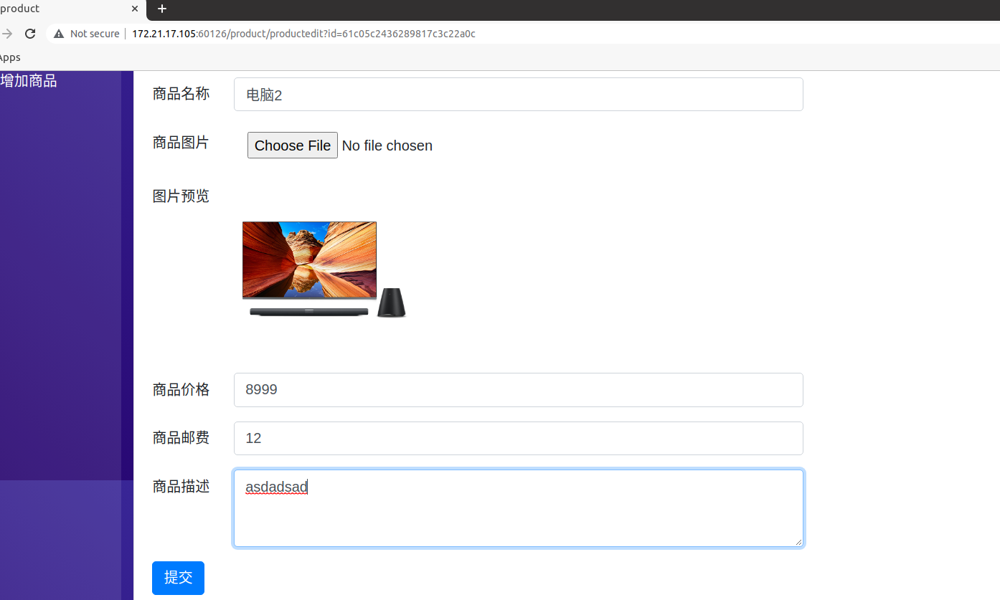

提交后显示：

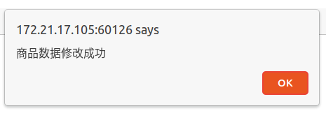

查看修改数据：

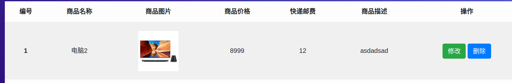

#### 删除数据：

点击图中数据的删除按钮：

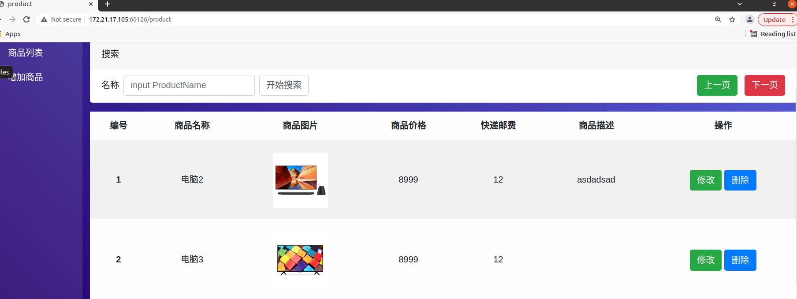

即可成功删除

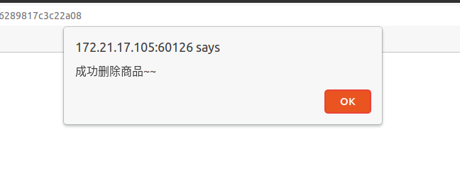

删除后更新列表：

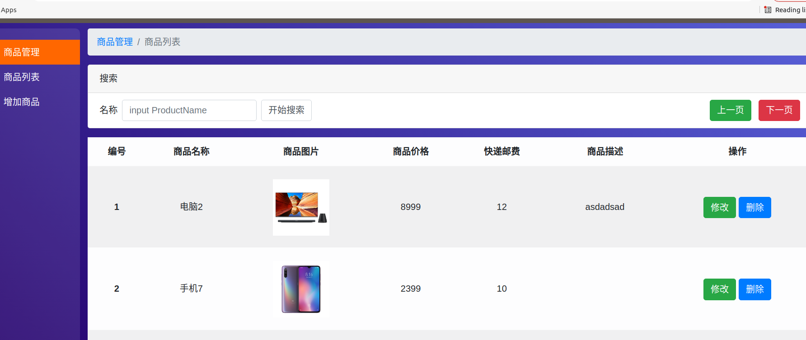

#### 同时可以在页面进行查询功能：

搜索框内输入电脑：

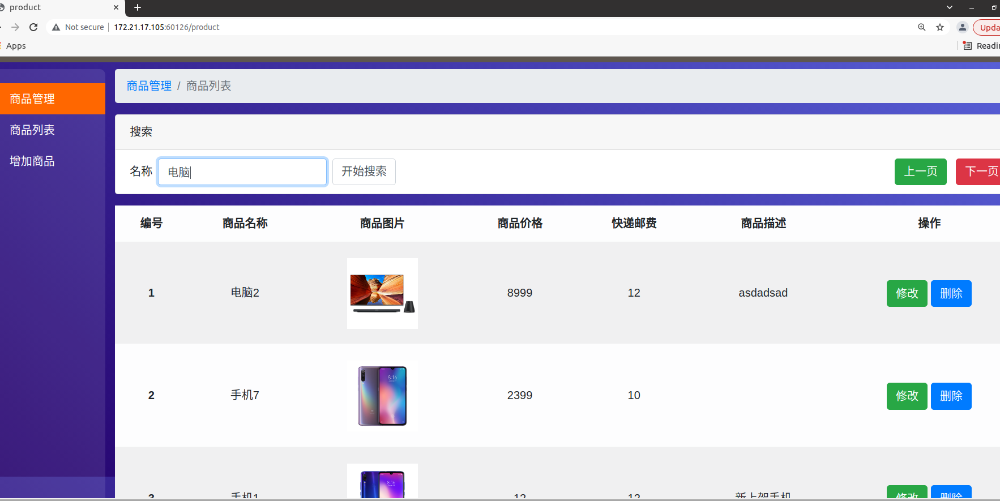点击搜索按钮后，即可得到查询信息（如果没有显示则需要点击上一页进行刷新)：

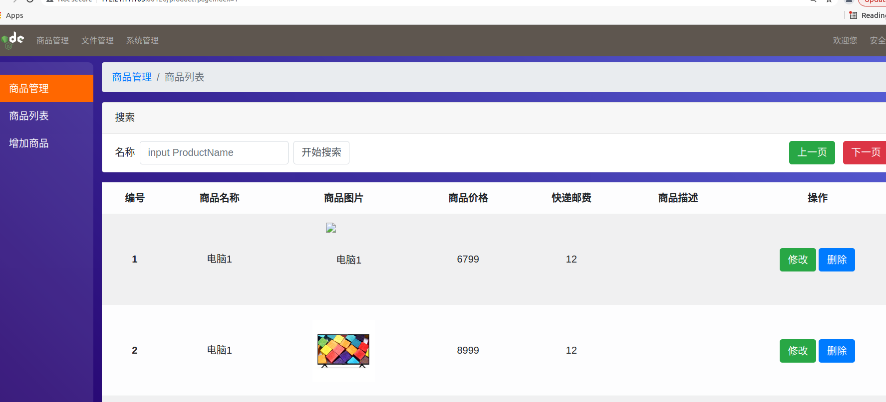

#### 对用户而言，登陆后即可看到上架后的商品，了解信息，也可以在搜索框上进行查找，过程同上。

用户登陆：

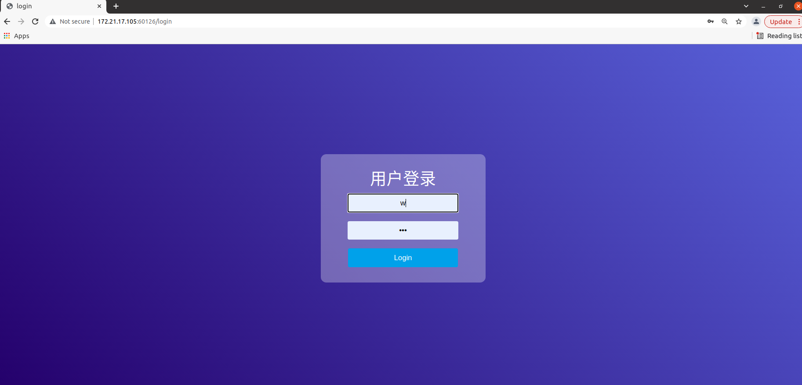

用户界面：

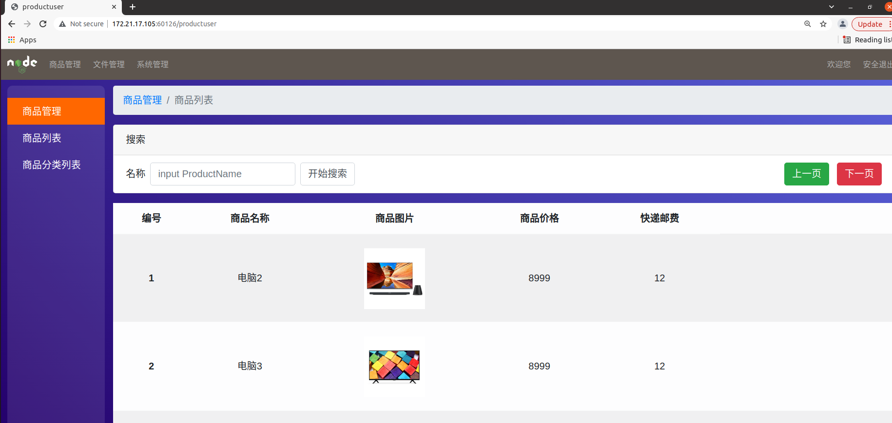

查看完毕后，可点击右上角的安全退出功能，跳转到主页面：

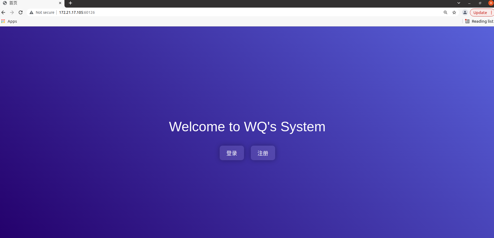

##### 注：操作过程可能需要点击“上下一页“或者“开始搜索“等按钮进行刷新，可能是有延迟

# 3）开发日记（与commit对应）

2021/12/19：在博客内搜索相关程序项目，https://blog.csdn.net/qq_41672008/article/details/90239071在该博客上查找到相关开源程序，并在本机上成功测试运行。

2021/12/20：上午对源程序进行修改，想实现用户与管理员划分，但一直不成功。中午吃过饭后，再回来进行实现，选择另一种思路，重新设置了用户与管理员的判断条件。根据这种简单的方法，可以实现划分，但仍然有很明显的瑕疵。

晚上，基于上述的代码下，我将源代码的部分功能进行调整，因为本身的源代码有许多瑕疵，我与同学相互讨论，将代码稍加修改。现在的项目基本上实现各项功能，已经开始搭建起来了。

2021/12/23：

上午：

将功能进行再一次优化完善，重新设置了页面，新增了用户安全退出的功能，完成实现，并尝试部署到服务器。而在这个过程出现了问题。

根据操作步骤走下来，当我第一次输入node app.js 时，结果跳出address not avaliable ：172.21.17.105：10126 报错。在百度博客等地方搜索后，发现是端口号被占用的错误。于是我根据老师上传的端口清除步骤对端口进行清理，但是输入lsof -i:10126后并没有显示。

中午：

根据视频指导，我发现我当前的端口号并没有调用，可是依然不能运行。于是后来反复询问老师，才明白我把172.21.17.105用const定义，将其写固定了，所以在使用172.21.2.236时不允许运行。

修改后，便可以在服务器上正常运行，但问题又出现了，系统登陆后不能进行后续的操作。于是项目进展再一次停滞不前......茫然....

下午：

我原以为是路径配置时，设限了，但并没有发现相关问题。我的同学则是认为数据库没有连接上，可是并不知道如何修改。

改了一下午，判断在/doLogin出错，试了不同方法依然不行。我隐隐约约感觉是哪里的环节出现bug，应该不是很复杂的问题，可就是没找出来。

无奈之下，我们又跑去询问了老师，再一次在老师的帮助下进行调试，最后终于发现，在nohup node时，我选取的主程序本身就是错误的！应该是app.bac.js 我一直将其和app.js弄混淆了！最后赶紧回到项目前，又开始进行调整，最后终于成功运行！！

傍晚：

整个项目成功部署到服务器中并能正常运行，基本上结束了。不过在用户与管理员划分处，基于前几天的明显的瑕疵，我又把它进一步改善了。

新增一项对话框功能：在用户注册时，如果用户名与管理员相撞，随即会跳出“请重新定义您的用户名”的对话框，下一步将不能进行。目的是提醒用户注册时不要误入，防止用户与管理员混淆。

至此该程序终于全部修改完毕。
